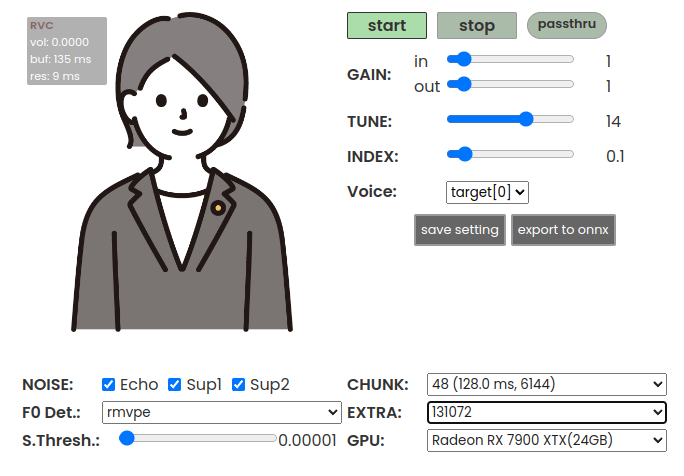
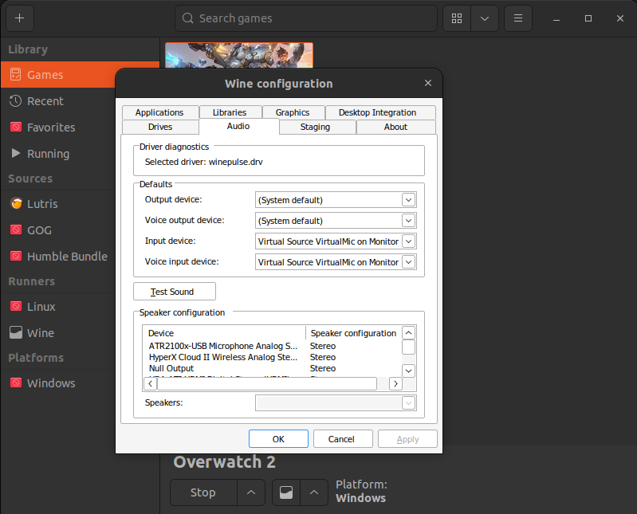

# Voice Changer for AMD GPUs under Linux

## Introduction

At the moment, there are significant challenges in using machine learning solutions with an AMD GPU under Windows due to the lack of driver support. While AMD has released ROCm for newer GPUs, there is still no MIOpen release for Windows. Without MIOpen, there won't be a PyTorch release. DirectML is currently the only hardware-independent solution, but it offers poor performance and requires ONNX models that cannot load an index.

Fortunately AMD has good driver support under Linux, and with ROCm, you can utilize the CUDA implementation of the voice changer, resulting in a significant performance improvement. You'll be able to use standard models, including index files. While Linux is not typically associated with gaming, tools like [Steam Proton](https://www.protondb.com/), [Lutris](https://lutris.net/), and [Wine](https://www.winehq.org/) enable you to play most games on Linux.

**Benchmark with Radeon RX 7900 XTX:**
- DirectML: Chunk 112 with Extra 8192 (using rmvpe_onnx)
- CUDA: Chunk 48 with Extra 131072 (using rvmpe)

## Prerequisites

### AMDGPU Driver and ROCm

First, you need to install the appropriate drivers on your system. Most distributions allow easy driver installation through the package manager. Alternatively, you can download the driver directly from the [AMD website](https://www.amd.com/en/support). Select "Graphics", your GPU, and download the version compatible with your distribution. Then install the driver directly using your package manager by referencing the downloaded file.

Next, install ROCm following the [official AMD guide](https://rocm.docs.amd.com/en/latest/deploy/linux/index.html). You can install the package using the [package manager](https://rocm.docs.amd.com/en/latest/deploy/linux/os-native/install.html) or by using the [AMDGPU Install script](https://rocm.docs.amd.com/en/latest/deploy/linux/installer/index.html).

### Anaconda (optional)

The second dependency is optional but recommended. Anaconda can be used to manage Python packages and environments, preventing dependency conflicts when using multiple software with the same libraries. Many distributions allow Anaconda installation through the [package manager](https://docs.anaconda.com/free/anaconda/install/linux/). Alternatively, download the package from the [Anaconda website](https://www.anaconda.com/download) and manually run the installer:


```bash
cd ~/Downloads
chmod u+x Anaconda3-xxx-Linux-x86_64.sh
./Anaconda3-xxx-Linux-x86_64.sh
```

## Setup Environment
Now create a new environment, download the voice changer, and set up the dependencies. First create the new environment using conda and specify a Python version. Python 3.10.9 works well with ROCm 7.2 - for other versions check the PyTorch documentation:

```bash
conda create --name voicechanger python=3.10.9
```

Activate the environment to install dependencies within it:

```bash
conda activate voicechanger
```

Next create a new directory and clone the Github repository. Using this solution you don't need to download a release from HuggingFace.

```bash
mkdir ~/Documents/voicechanger
cd ~/Documents/voicechanger
git clone https://github.com/w-okada/voice-changer.git
```


## Install Dependencies

After downloading the repository, install all dependencies. Start with PyTorch for ROCm. AMD provides a [guide](https://rocm.docs.amd.com/projects/radeon/en/latest/docs/install/install-pytorch.html) for installing the correct PyTorch version, which is updated regularly. Begin by downloading Torch and Torchvision because the other steps are handled automatically when creating the conda environment:

```bash
# The versions of the Wheels can vary based on your GPU and the current ROCm release
wget https://repo.radeon.com/rocm/manylinux/rocm-rel-5.7/torch-2.0.1%2Brocm5.7-cp310-cp310-linux_x86_64.whl
wget https://repo.radeon.com/rocm/manylinux/rocm-rel-5.7/torchvision-0.15.2%2Brocm5.7-cp310-cp310-linux_x86_64.whl
```

Your directory should now look like this:

```bash
$ ls
torch-2.0.1+rocm5.7-cp310-cp310-linux_x86_64.whl
torchvision-0.15.2+rocm5.7-cp310-cp310-linux_x86_64.whl
voice-changer
```

Now, install PyTorch within the environment:

```bash
pip3 install --force-reinstall torch-2.0.1+rocm5.7-cp310-cp310-linux_x86_64.whl torchvision-0.15.2+rocm5.7-cp310-cp310-linux_x86_64.whl 
```

To run the voice changer, install additional dependencies using pip. Navigate to the server directory and use pip to install the requirements.txt file:

```bash
cd ~/Documents/voicechanger/voice-changer/server
pip install -r requirements.txt
```

## Start the server
After installing the dependencies, run the server using the MMVCServerSIO.py file:

```bash
python3 MMVCServerSIO.py
```

The server will download all the required models and run. Now you can use the voice changer through the WebUI by opening http://127.0.0.1:18888/. You can select your GPU from the menu.



## Configure Audio Loopback
In the last step, create a virtual audio device that redirects the web UI's output to an input, which can be used as a microphone in applications.

Most distributions use PulseAudio by default, and you can create an audio loopback by creating two virtual devices. There is a [guide](https://github.com/NapoleonWils0n/cerberus/blob/master/pulseaudio/virtual-mic.org) for setting up virtual audio devices. At the top of the document, you'll find a solution for a temporary setup. Creating the default.pa config will create a permanent device.

The default names of the audio devices are:
- Input: Virtual Source VirtualMic on Monitor of NullOutput
- Output: Null Output

In most applications, you can select the audio device as input. If you use Wine or Lutris and want to use the microphone within those environments, you need to add the device to your Wine configuration.

